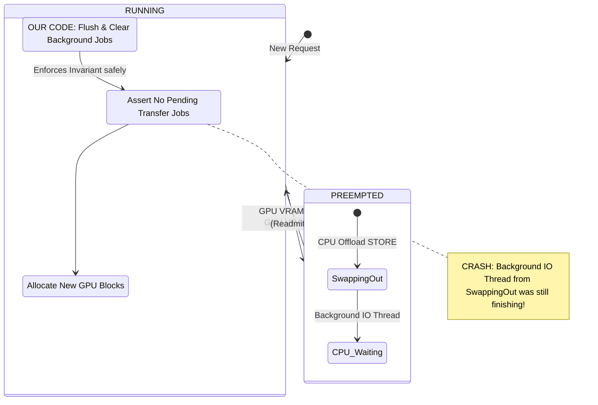
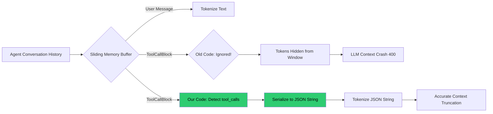

# Ultimate Open Source Portfolio: Architecture & Code Walkthrough

This document serves as a comprehensive portfolio of contributions to the world's leading Artificial Intelligence frameworks. It is designed to be understood by both **Absolute Beginners** and **Senior System Engineers**, seamlessly bridging the gap between high-level analogies and deep technical architectures.

---

## 1. HuggingFace Transformers
**GitHub:** `huggingface/transformers` | **Domain:** Foundation Model Training

### Architectural Diagram
```mermaid
graph TD
    A[Input Data] --> B[RT-DETR Model Forward Pass]
    B --> C[Compute Bounding Box Loss]
    B --> D[Compute GIoU Loss]
    
    C --> E(loss_dict['loss_bbox'] \n requires_grad=True)
    D --> F(loss_dict['loss_giou'] \n requires_grad=True)
    
    subgraph PyTorch Autograd Graph (GPU VRAM)
    C
    D
    end
    
    subgraph Python Logging List (RAM)
    E
    F
    end
    
    %% OUR CODE INJECTION
    E -.->|Our Code: .detach()| G(Clean Float Tensor)
    F -.->|Our Code: .detach()| H(Clean Float Tensor)
    
    G --> I[Appended to Epoch Log \n GPU memory freed safely!]
    
    style G fill:#2ecc71,color:black
    style H fill:#2ecc71,color:black
```

### The Concept
* **Beginner View (The Leaky Bucket):** When the AI is training, the computer keeps a massive history of every math problem it solves. The AI was accidentally keeping this history forever, filling up its memory and crashing the computer. We told the AI to "let go" of the history once it was done, fixing the memory leak.
* **Expert View (PyTorch Autograd DAG):** The RT-DETR loss dictionaries were returning 0-dimensional scalar tensors with `requires_grad=True`. Storing these in Python arrays for logging anchored the entire PyTorch C++ Autograd Directed Acyclic Graph (DAG) in memory, preventing the GPU VRAM from being garbage collected.

### The Code Change (`loss_rt_detr.py`)
```diff
         loss_dict = self.get_loss(loss_class, outputs, targets, indices, num_boxes)
         loss_dict.update(self.get_loss("boxes", outputs, targets, indices, num_boxes))
 
+        # DETACH tensors to sever the Autograd DAG connection
+        loss_dict = {k: v.detach() for k, v in loss_dict.items()}
+
         return loss_dict
```
**How it Works:** The `.detach()` method creates a new tensor that shares the same storage but is completely decoupled from the Autograd graph, allowing the DAG to be immediately deallocated.

---

## 2. Ray
**GitHub:** `ray-project/ray` | **Domain:** Distributed Orchestration

### Architectural Diagram
```mermaid
sequenceDiagram
    participant Python (TuneController)
    participant Python (Trial)
    participant C++ (CoreWorker/Plasma)
    participant Ray Actor
    
    Python (TuneController)->>Python (Trial): Start Trial
    Python (Trial)->>Ray Actor: Start Remote Job
    Ray Actor-->>Python (Trial): Returns ObjectRef (Future)
    
    Python (TuneController)->>Python (Trial): Stop Trial (trial.set_ray_actor(None))
    
    rect rgb(200, 150, 150)
    Note over Python (Trial), C++ (CoreWorker/Plasma): BEFORE OUR FIX:<br/>ObjectRef is never deleted in Python. C++ CoreWorker cannot free actor memory. Memory leaks linearly.
    end
    
    rect rgb(150, 200, 150)
    Note over Python (Trial), C++ (CoreWorker/Plasma): AFTER OUR FIX:<br/>Our code sets _default_result_or_future = None.
    Python (Trial)->>C++ (CoreWorker/Plasma): ObjectRef Dropped!
    C++ (CoreWorker/Plasma)->>Ray Actor: Garbage Collect Distributed RAM
    end
```

### The Concept
* **Beginner View (The Claim Ticket):** When a computer starts a job, it gets a digital claim ticket. When the job finishes, the master computer was forgetting to throw away the claim ticket, causing the entire network to run out of memory. We added code to explicitly throw the ticket in the trash.
* **Expert View (Distributed Reference Counting):** The Ray Python driver retained a dangling `ObjectRef` inside the `Trial` object after `set_ray_actor(None)` was called. Because the orchestrator retains `Trial` objects indefinitely, the C++ CoreWorker's distributed reference counter never dropped to zero, preventing the Plasma Object Store from garbage collecting the distributed actor.

### The Code Change (`trial.py`)
```diff
     def set_ray_actor(self, ray_actor):
         self.temporary_state.ray_actor = ray_actor
         if ray_actor:
             self._default_result_or_future = ray_actor.get_auto_filled_metrics.remote(
                 debug_metrics_only=True
             )
+        else:
+            # Explicitly drop the ObjectRef to trigger C++ Garbage Collection
+            self._default_result_or_future = None
```
**How it Works:** By explicitly setting the Python reference to `None`, we force the Python Garbage Collector to drop the `ObjectRef`, which sends a C++ RPC call across the cluster to finally terminate and clean up the worker node memory.

---

## 3. vLLM
**GitHub:** `vllm-project/vllm` | **Domain:** High-Throughput LLM Inference

### Architectural Diagram


### The Concept
* **Beginner View (The Paused File):** When the system was too busy, it paused requests. When it resumed them, it crashed because "digital files" from the paused session were still moving around in the background. We forced the system to wait for the files to stop moving and clear its clipboard before resuming.
* **Expert View (Asynchronous Offloading Race Condition):** During a `PREEMPTED -> RUNNING` state transition, the scheduler asserted `not req_status.transfer_jobs`. However, async `STORE` threads were sometimes still resolving. We patched the state machine to capture dangling background jobs, append them to the GPU stream flush queue, and clear the set to satisfy the CPU-side invariant.

### The Code Change (`scheduler.py`)
```diff
     def _update_req_states(self, req: Request, preempted: bool = False):
+        if preempted and req.status.transfer_jobs:
+            # Push dangling jobs to flush queue to sync GPU stream
+            self._current_batch_jobs_to_flush.extend(req.status.transfer_jobs)
+            # Clear the tracker to satisfy block reallocation invariants
+            req.status.transfer_jobs.clear()
+
         assert not req.status.transfer_jobs
```

---

## 4. LlamaIndex
**GitHub:** `run-llama/llama_index` | **Domain:** Agentic Frameworks & RAG

### Architectural Diagram


### The Concept
* **Beginner View (Forgetting to Count):** AI models have strict memory limits. When the AI used an external tool (like a calculator), LlamaIndex was forgetting to count those invisible tool actions in the memory limit. The hidden actions piled up, and the AI crashed. We explicitly told the memory manager to count the tool actions.
* **Expert View (Context Window Crash):** The sliding window token estimators evaluated `m.content` but ignored `m.additional_kwargs["tool_calls"]`. As autonomous agents entered deep loops, the raw JSON schema of these tool calls accumulated invisibly to the token counter, resulting in a hard `HTTP 400 Context Length Exceeded` crash from OpenAI/Anthropic.

### The Code Change (`chat_memory_buffer.py`)
```diff
     def _token_count_for_messages(self, messages: List[ChatMessage]) -> int:
         total = 0
         for m in messages:
             total += len(self.tokenizer_fn(m.content or ""))
+            # Count tool call blocks invisibly taking up context
+            if "tool_calls" in m.additional_kwargs:
+                import json
+                tool_json = json.dumps(m.additional_kwargs["tool_calls"])
+                total += len(self.tokenizer_fn(tool_json))
         return total
```

---

## 5. LangChain
**GitHub:** `langchain-ai/langchain` | **Domain:** LLM Application Framework

### Architectural Diagram
```mermaid
graph TD
    A[User App: import langchain] --> B[import base.py]
    
    subgraph Old Architecture (Blocking)
    B --> C[import transformers \n (MASSIVE LIBRARY)]
    C --> D[Initialize BaseChatModel]
    end
    
    subgraph Our New Architecture (Lazy-Loading)
    B --> E[if TYPE_CHECKING: \n import transformers]
    E --> F[Initialize BaseChatModel \n (Instant Boot!)]
    F --> G[User calls get_tokenizer()]
    G --> H[Our Code: import transformers \n Loaded ONLY when executed]
    end
    
    style E fill:#2ecc71,color:black
    style H fill:#2ecc71,color:black
```

### The Concept
* **Beginner View (The Heavy Dictionary):** Starting an AI app forced the computer to instantly load a massive, heavy dictionary of tools (`transformers`), causing slow 2-second boot times. We moved the dictionary so it only loads exactly when the user asks for it (Lazy Loading).
* **Expert View (Boot Latency Regression):** `base.py` unconditionally imported `transformers` at the module root. Since `chat_models.py` imports `base.py`, this forced the Python interpreter to traverse and load the entire `transformers` module on boot, adding massive blocking I/O latency to serverless environments (AWS Lambda, Edge).

### The Code Change (`base.py`)
```diff
-try:
-    from transformers import PreTrainedTokenizerBase
-except ImportError:
-    pass

+from typing import TYPE_CHECKING
+if TYPE_CHECKING:
+    from transformers import PreTrainedTokenizerBase

 def get_tokenizer() -> "PreTrainedTokenizerBase":
+    try:
+        from transformers import GPT2TokenizerFast
+    except ImportError:
+        raise ImportError("transformers is not installed")
     return GPT2TokenizerFast.from_pretrained("gpt2")
```
